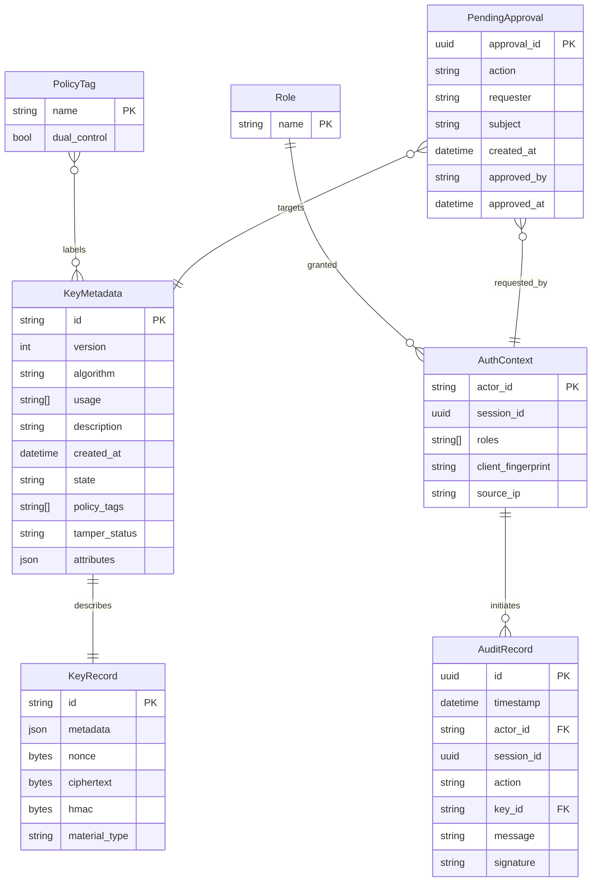

# FerroHSM Domain Model (ERD)

## Notes
- `KeyRecord` stores sealed key material and metadata in the filesystem-backed store, with immutable per-version files (`keys/<id>/vNNNNNNNN.json`) and a `current.json` pointer to the active version.
- `KeyMetadata.attributes` persists PKCS#11-aligned attribute maps that are indexed by every storage backend (in-memory, filesystem, SQLite) to accelerate attribute-based lookups.
- `AuditRecord` entries include optional HMAC signatures for tamper evidence.
- `PolicyTag` represents the configuration driving dual-control requirements; currently stored in-memory but modeled for future persistence.
- JWT bearer tokens establish `AuthContext` values; tokens include roles, optional session UUID, and context fingerprints.
- `PendingApproval` records are persisted on disk and represent queued dual-control requests plus completed approvals.
- Per-actor rate limiting is enforced outside the core domain model but uses the `actor_id` from `AuthContext` as the throttle key.
