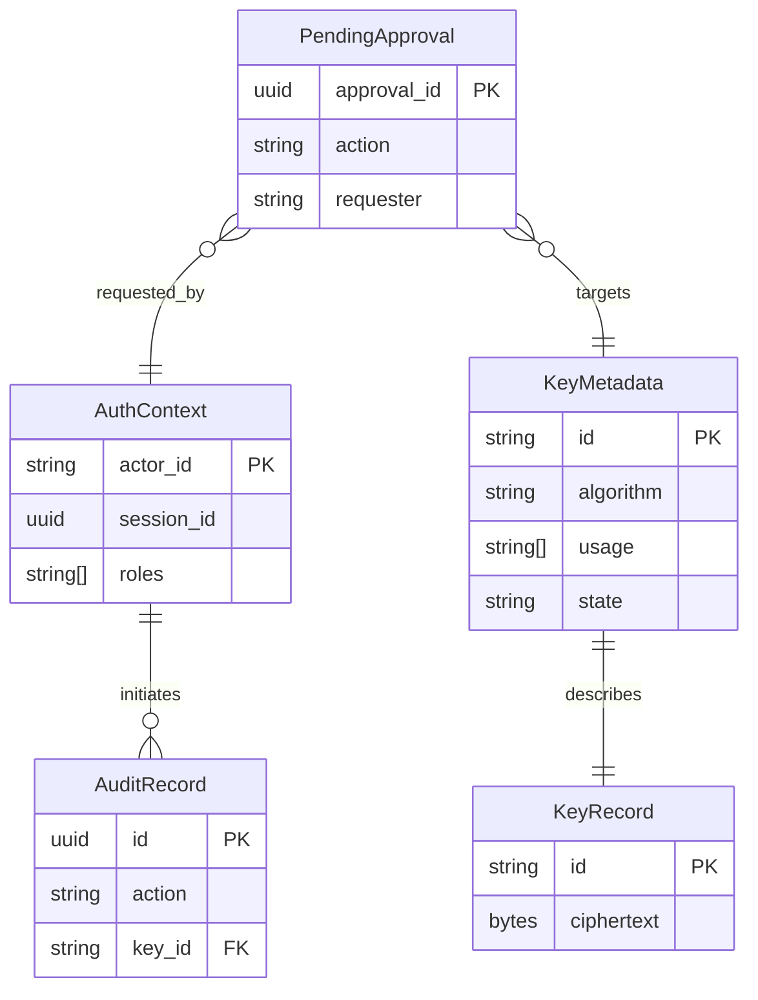

# FerroHSM Project Documentation

FerroHSM is a software-based Hardware Security Module implemented in Rust with Secure by Design principles. It offers cryptographic key management, tamper-evident storage, role-based access control, and multiple interfaces for integration with modern platforms.

## 🏗️ Architecture & Security

### High-Level Architecture
FerroHSM follows a modular, agent-based architecture where independent components (agents) handle specific responsibilities.

```mermaid
+--------------------------+        +------------------+
|   Management Surfaces    |        |  Integration SDK |
|  (CLI, TUI, Web UI,      |        |  (Go, Python)    |
|   REST, PKCS#11 facade)  |        +------------------+
+-------------+------------+
              |
              v
+-------------+------------+
| AuthN/AuthZ Gateway      |  -> JWT/RBAC validation, rate limiting, TLS mTLS termination
+-------------+------------+
              |
              v
+-------------+------------+
|  Policy & Session Layer  |  -> Policy evaluation, dual control, workflow engine
+-------------+------------+
              |
       Trusted Channel
              |
+-------------+------------+
|    Cryptographic Core    |  -> Key manager, crypto operations, tamper store
|  (hsm-core crate)        |
+-------------+------------+
              |
              v
+-------------+------------+
| Secure Storage Providers |  -> Encrypted file store, SQLite-backed store, in-memory/dev store, remote KMS/HSM backends
+--------------------------+
```

### Trust Boundaries
1. **Network Boundary**: TLS 1.3 with optional mutual authentication.
2. **Gateway Boundary**: Authentication layer validates JWTs with reloadable keysets.
3. **Policy Boundary**: Policy evaluation and session management.
4. **Core Boundary**: `hsm-core` is the sole module with direct access to key material.
5. **Storage Boundary**: Keys are encrypted-at-rest using operator-provisioned secrets.

### Crate Overview
- `hsm-core`: Cryptographic core (AES, RSA, ECC, PQC, policy enforcement).
- `hsm-server`: Axum-based HTTPS service with REST APIs and management UI.
- `hsm-cli`: Administrative command-line client.
- `hsm-pkcs11`: PKCS#11 interface/adapter layer.
- `hsm-tui`: Interactive terminal-based user interface.

## 📊 Domain Model (ERD)



## 🛠️ Installation & Build Status

### Prerequisites
- **Rust** (1.75+)
- **cmake** (v4.1.2 or later)
- **OpenSSL 3**

### Current Build Status
| Component | Status | Notes |
| :--- | :--- | :--- |
| `hsm-core` | ✅ Pass | Core crypto functional |
| `hsm-cli` | ✅ Pass | CLI functional |
| `hsm-server` | ❌ Fail | PQC API mismatches |
| `hsm-pkcs11` | ❌ Fail | Unresolved imports/type mismatches |

> [!WARNING]
> PQC features are currently disabled due to compilation errors in the server and PKCS#11 modules.

## 🚀 Development Roadmap

### High Priority (Critical for v1.0)
- **PKCS#11 Completion**: Finish session/token management and crypto mechanisms.
- **PQC Fixes**: Resolve API mismatches and missing methods in OqsCryptoProvider.
- **Audit Hardening**: Implement hash-chain anchoring to external stores.

### Medium Priority
- **Hardware Integration**: Define traits for hardware operations and cloud HSM adapters.
- **Metrics**: Add Prometheus histograms and OpenTelemetry tracing.
- **TUI/CLI**: Batch operations and advanced filtering.

### Low Priority
- **SDKs**: TypeScript and .NET SDK support.
- **K8s**: Helm charts and service mesh integration.
- **Compliance**: FIPS 140-3 and SOC 2 readiness.

---
**Maintainer**: Nuzli L. Hernawan (@foozio)  
**License**: [MIT](./LICENSE)
